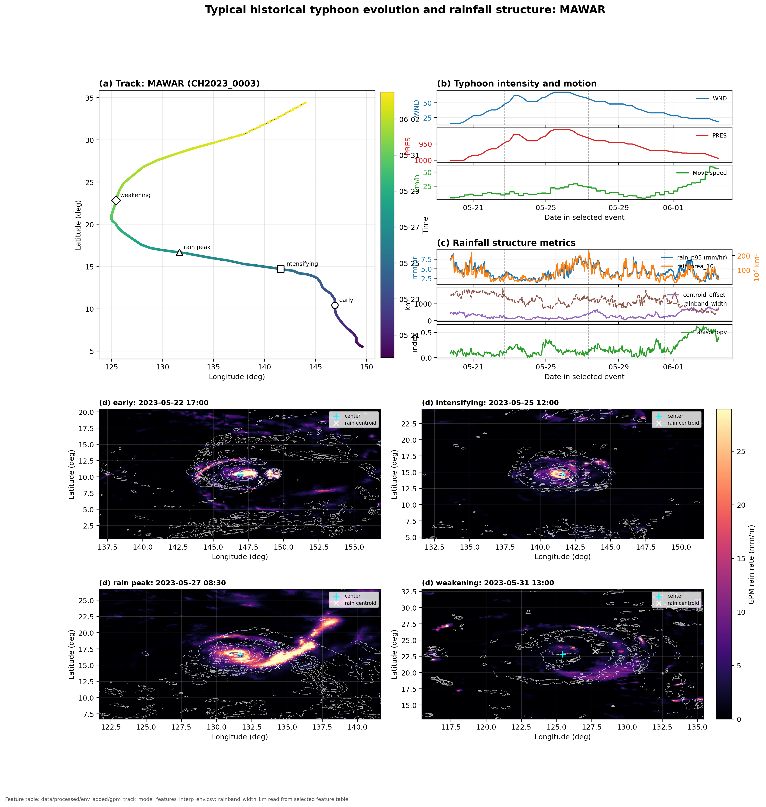
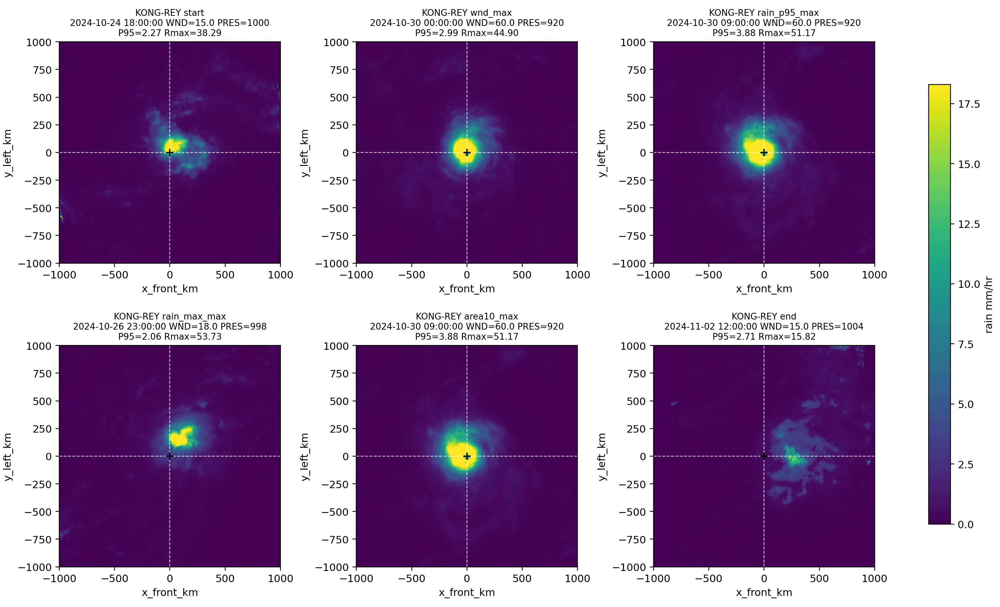
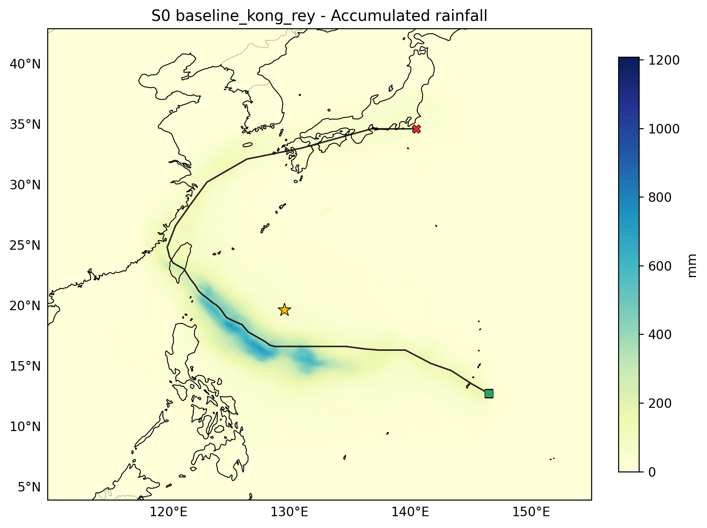
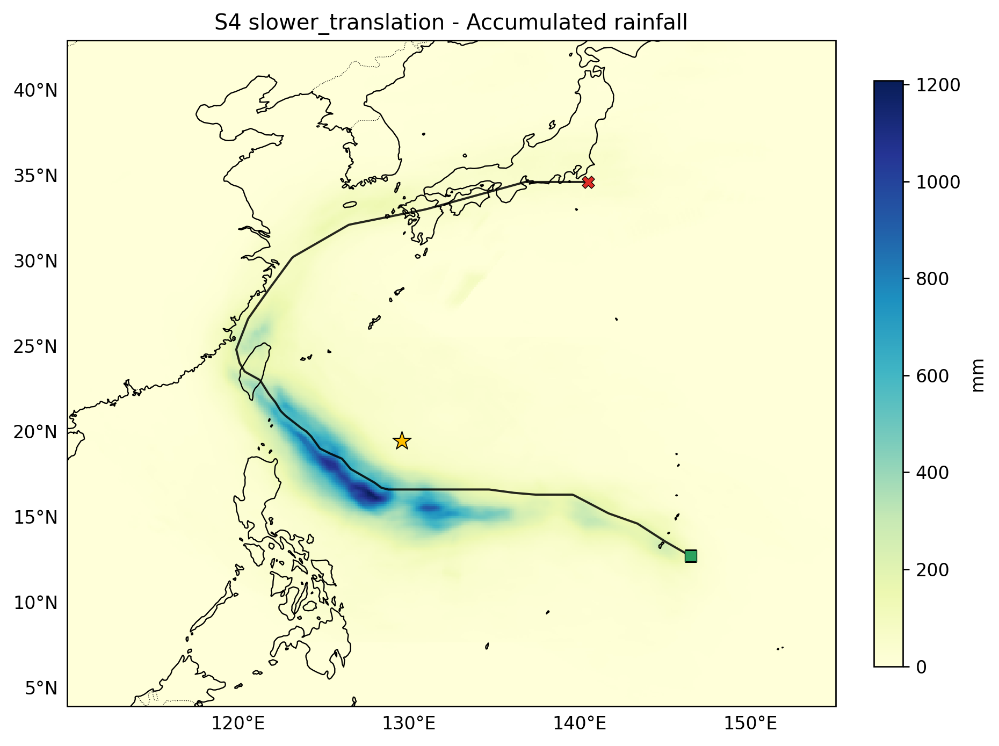

# 台风极端降水结构分析与降水场生成

**中文** | [English](README.md)

> 数学建模竞赛参赛项目。围绕「路径—强度—环境—降水」关系，构建台风降水结构分析、缺测台风降水场生成与未来虚拟台风情景模拟的综合模型。

> **获奖情况：** 本项目荣获北京师范大学数学建模比赛二等奖。

基于 **CMABST 台风路径资料** 与 **GPM 半小时降水资料（IMERG）**，把台风降水从「散乱的格点场」抽象为一套可解释的结构指标，再用机器学习与相似样本迁移方法，完成从「解释历史规律」到「生成缺测降水」再到「推演虚拟情景」的完整链路。

---

## 解决的三个问题

### 问题一　降水结构的驱动因素分析
- 建立以**台风中心 + 移动方向**为基准的**相对运动坐标系（storm-relative）**，将每个降水场旋转对齐到统一参考系。
- 提取降水结构指标体系：最大雨强、P95/P99 分位雨强、强降水面积、降水质心偏移、前后/左右非对称性、雨带各向异性、雨带宽度、四象限降水贡献等。
- 引入解释变量：最大风速、中心气压、移动速度、移动方向、距岸距离、陆地覆盖比例、地形起伏等。
- 用 **Spearman 相关分析 + 增强随机森林** 定量识别关键驱动因素。
- **结果**：随机森林在「降水质心偏移」「雨带各向异性」上的测试集 R² 分别达到 **0.684 / 0.640**；降水整体偏向台风移动方向的**前侧与左侧**（前左象限降水占比最高）。

<p align="center">
  <br>
  <em>典型台风在相对运动坐标系下的降水结构及其演变。</em>
</p>

### 问题二　缺测台风的降水场生成
2024 年 **KONG-REY** 与 **MAN-YI** 在 GPM 数据中无对应记录，因此将降水模拟转化为**条件降水场生成问题**：
1. 从历史台风样本中检索与目标时刻路径、强度、移动、近岸条件相似的时次（Top-K 相似模板）；
2. 在相对运动坐标系下做**相似模板迁移与加权融合**；
3. 用 **EOF / PCA** 修正大尺度空间结构；
4. 用**极端分位数校准**恢复强降水尾部。
- **结果**：生成两场台风完整的半小时降水过程（KONG-REY 421 时次、MAN-YI 553 时次），最大格点雨强 **53.7 / 54.4 mm·h⁻¹**，主雨区均位于移动方向左前侧。

<p align="center">
  <br>
  <em>为无 GPM 观测的 KONG-REY 生成的代表性半小时降水场。</em>
</p>

### 问题三　虚拟台风情景模拟
以 KONG-REY 为基准，构造**强度增强、路径近岸偏移、移速减慢、复合扰动**等虚拟情景，将扰动后的变量重新输入问题二的生成模型。
- **结果**：移速减慢情景（S4）对固定地理位置的累计降水与持续时间放大最显著——最大累计降水由 **723.5 mm → 1208.1 mm**，最大强降水持续时间由 **24.5 h → 39.0 h**，揭示台风滞留对极端降水风险的放大效应。

| 基准情景 (S0) | 移速减慢情景 (S4) |
|:---:|:---:|
|  |  |

<p align="center"><em>累计降水：基准 vs. 移速减慢情景——台风滞留显著放大固定地点的累计降水（723.5 → 1208.1 mm）。</em></p>

### 模型检验
设计**历史台风伪缺失实验**：将有真实 GPM 记录的历史台风当作未知事件，用同一流程反推验证。极端分位数校准后，P95 误差、P99 误差、10 mm·h⁻¹ 强降水面积误差相较初始模板场分别下降 **39.7% / 39.4% / 37.1%**。

---

## 仓库结构

```
.
├── scripts/        主分析流水线（44 个脚本，按编号顺序执行）
│   ├── 00a–00e_*   阶段0：CMABST 路径解析、目标台风轨迹提取、近岸特征、轨迹可视化
│   ├── 02–16_*     数据预处理：GPM 特征提取、轨迹-降水时空匹配、特征工程、泄漏检查
│   ├── 17–25_*     问题一/二：相对运动坐标系、随机森林、相似检索、模板生成、PCA 修正、分位校准
│   ├── 26–31_*     问题三：虚拟情景构造、情景降水场生成、事件指标与落区图
│   └── 32–35_*     雨带宽度诊断、典型台风演变可视化
│   └── rainband_width_utils.py   雨带宽度计算公共模块
├── output/         阶段0（轨迹预处理）产物：目标台风轨迹 csv 与路径图
├── outputs/        主流程产物：figures/ 图、tables/ 表、reports/ 与各 *_qc_report.md 质检报告
├── paper.tex       建模论文 LaTeX 源码
├── requirements.txt
└── .gitignore
```

> 注：`output/`（轨迹预处理）与 `outputs/`（主流程）是两个不同阶段的产物目录，沿用了项目开发时的命名。

---

## 技术栈

Python 3.9+ · numpy · pandas · scipy · **scikit-learn**（随机森林）· **rasterio**（GPM/地形栅格读取）· shapely（海陆/距岸几何）· matplotlib · tqdm

方法层面涉及：storm-relative 坐标变换、Spearman 相关、随机森林与特征重要性、KNN 相似检索、EOF/PCA 结构分解、分位数映射校准。

---

## 数据说明（仓库不含原始数据）

原始与中间数据体积达数 GB（GPM 半小时降水栅格、ETOPO 地形、各类 `.npz` 生成场等），**已通过 `.gitignore` 排除**，不随仓库分发。复现需自行准备：

- **CMABST 台风最佳路径资料**（中国气象局上海台风研究所）
- **GPM IMERG 半小时降水产品**（NASA GES DISC）
- **ETOPO 2022** 地形数据（NOAA）

按脚本中 `data/raw/`、`data/processed/` 的路径约定放置后即可运行。

## 复现

```bash
pip install -r requirements.txt
# 准备好 data/ 下的原始数据后，按编号依次运行：
python scripts/00a_parse_cmabst.py
python scripts/02_extract_gpm_features.py
# ... 依序执行至 scripts/35_*
```

各脚本均可独立运行，从项目根目录调用，路径相对根目录解析。

---

## 论文

`paper.tex` 为完整建模论文 LaTeX 源码，图表引用自 `outputs/figures` 与 `outputs/tables`，可直接用 XeLaTeX 编译。

## 说明

本项目为竞赛参赛作品，开发过程中使用了 AI 辅助工具协助代码编写与文档整理；模型设计、方法选择与结果分析为作者完成（详见论文中「人工智能工具使用说明」一节）。
